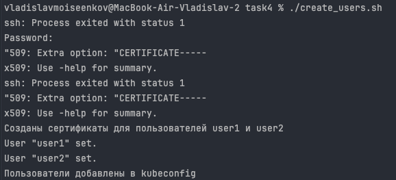
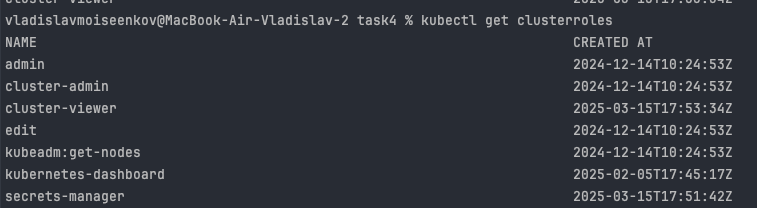
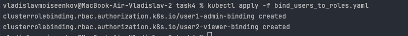
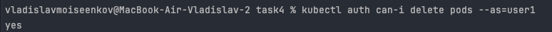
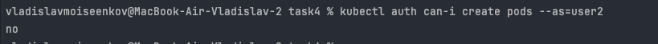

# Ролевой доступ к Kubernetes кластеру

## Описание
В рамках модели RBAC (Role-Based Access Control) определены три основные роли доступа к Kubernetes кластеру

---

## Таблица ролей и групп пользователей

| **Роль**             | **Полномочия**                                                                 | **Группа пользователей**    |
|----------------------|--------------------------------------------------------------------------------|-----------------------------|
| **Cluster Viewer**   | Просмотр всех ресурсов кластера (read-only доступ ко всем объектам кластера).  | viewers                    |
| **Cluster Admin**    | Полный доступ ко всем ресурсам кластера, включая управление инфраструктурой.   | admins                     |
| **Secrets Manager**  | Доступ на чтение и управление секретами и конфигами (secrets, configmaps).     | secrets-managers           |

## Создаем сертификаты для пользователей

## Создаем ClusterRoles

## Связываем пользователей и роли 
kubectl auth can-i list pods --as=alice

## Проверка
Пользователь user1 обладает ролью cluster_admin\
Может проверять список подов

Может создавать поды

Может удалять поды

Пользователь user2 обладает ролью cluster_viewer\
Не может создавать и удалять поды

