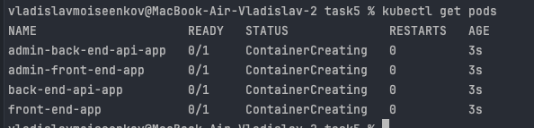
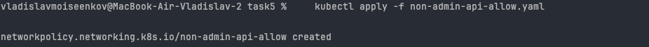
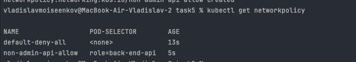
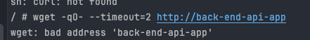

#### Запускаем поды
```shell
kubectl run front-end-app --image=nginx --labels role=front-end --expose --port=80
kubectl run back-end-api-app --image=nginx --labels role=back-end-api --expose --port=80
kubectl run admin-front-end-app --image=nginx --labels role=admin-front-end --expose --port=80
kubectl run admin-back-end-api-app --image=nginx --labels role=admin-back-end-api --expose --port=80
```


#### Создаем non-admin network-policy
1)Разрешить front-end общаться с back-end-api





2) запрещаем остальной трафик вне политики с помощью default-deny.yaml

3) Проверяем, что трафик недоступен из пода без метки front-end


